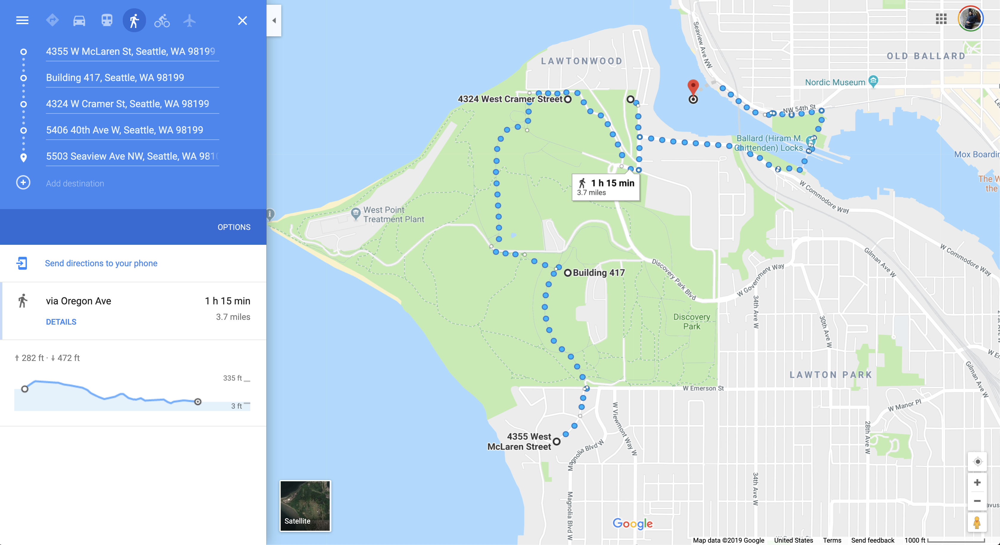

# Stroll

TT AEC Hackathon 2019 - Seattle

This is an app which helps people find the most nature-filled walks/paths to take thrughout the day in order to stimulate creativity and boost mental health.

Pathfinding is performed via Weighted Graph computation, with weights being given for characteristics such as proximity to parks, and amount of nature in the field of view.

## Proof of Concept

For the proof of concept application, we were not able to complete the functionality of a walk being a "loop", but we do calculate and find the most nature-filled walk given the input parameters and start point.

## Developer Guide

In the project directory, you can run:

### `npm start`

Runs the app in the development mode. 
Open [http://localhost:3000](http://localhost:3000) to view it in the browser.

The page will reload if you make edits. 
You will also see any lint errors in the console.

### `npm test`

Launches the test runner in the interactive watch mode. 
See the section about [running tests](https://facebook.github.io/create-react-app/docs/running-tests) for more information.

### `npm run build`

Builds the app for production to the `build` folder. 
It correctly bundles React in production mode and optimizes the build for the best performance.

The build is minified and the filenames include the hashes. 
Your app is ready to be deployed!

